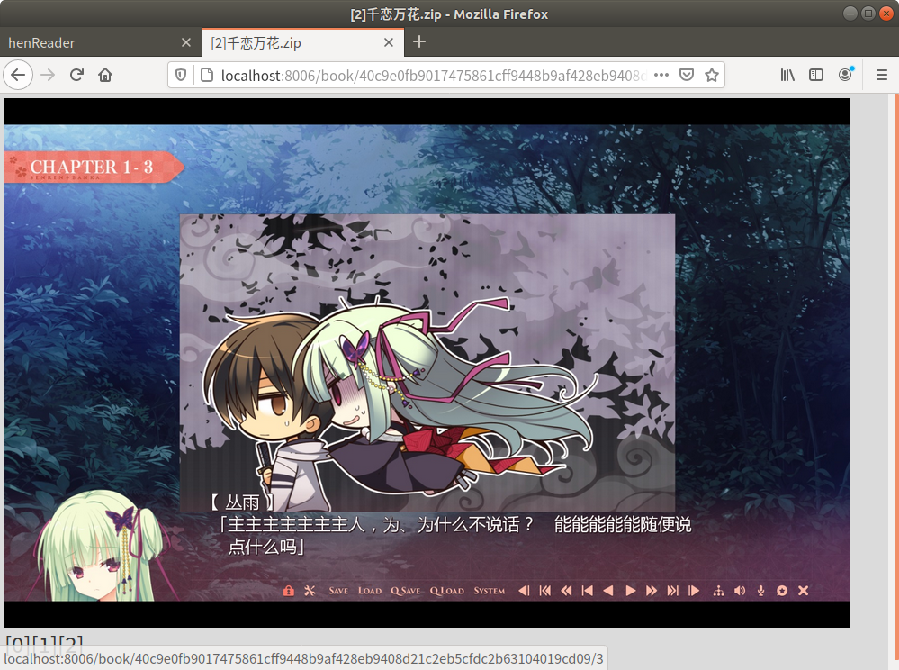

# henReader
## What's this
A HTML comic reader which supports *.zip & *.rar files.



## How to use
Till now, Windows / Linux / MacOS are surpposed.
(Linux / MacOS) Be sure that unrar has been installed. Windows version can directly use the unrar.exe in the folder. The installer can be get from [HERE](https://www.win-rar.com/predownload.html?spV=true&f=rarlinux-x64-5.9.1.tar.gz).
Windows filename/title display is now supported when running under Python 3, because generated HTML cache files are written in UTF-8. Thus Windows can work properly with Unicode filenames.

### Binary version
Just run henReader.exe (Windows) / henReader (Linux) in the folder.

### Code version
First of all, install python3 libraries:
```
pip3 install -r requirements.txt
```
And then:
```
python3 henReader.py
```

### Moreover
Customize your reader by modifing config.json.